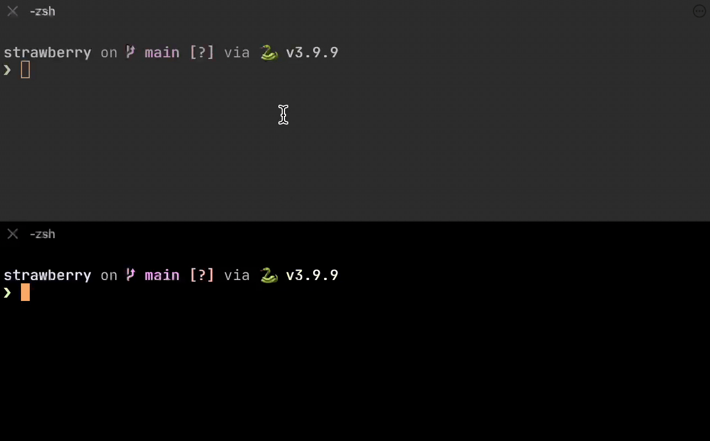

# 🍓 strawberry
### Say goodbye to complicated installation instructions and build steps.



## Contents
- [Requirements](#requirements)
- [Installation](#install)
- [Updating](#updating)
- [How it works](#how-it-works)
- [Commands](#commands)
- [Config](#config)

### Requirements
- python 3.6.8+
- pip
- git (only for install.sh script)

#### [Back to contents](#contents)

### Install

Linux:
```bash
curl -sSL https://cmdf.at/strawberry | bash
```

Windows:
```powershell
coming soon..
```

#### [Back to contents](#contents)

### Updating
Not yet implemented

#### [Back to contents](#contents)

### How it works

Strawberry is a cli tool to create a streamline development process for other command-line tools.

Strawberry aims to help with the development process of not only clis using frameworks but also cli tools that have no frameworks, by creating and compiling an entry point to these types of files using the "unpacked" type.

### Commands

##### Build:
The build command will compile the code in the current directory to the production directory, making a cli tool compiled and stored as a berry.

Ex.
```
> strawberry build
```

output flag:

Using the output flag will fix any conflicts between berry names by storing it a different parent directory.
```
> strawberry -o raspberry
```

##### Dev:
The dev command will launch a development environment which will listen to the specified directory for any changes and hot reload the development version of the command, to test out the command up-to-date and without having to manually compile every time.

The development command will be accessible through the `{berry_name}{dev_branch}`, for example: `strawberry-dev`

Ex.
```
> strawberry dev
```

listen flag:

The listen flag specifies the directory that it is listening to for changes.
```
> strawberry dev -l ./foo/bar
```

##### Install:
The install command is to install your berry to the path and initialize the environment for it, this command should be run if the berry has not been installed yet.

Ex.
```
> strawberry install
```

dev flag:

the dev flag will install the **development** version of the command, the path will be saved to either shellrc file or .profile (on windows it will go straight to path)
```
> strawberry install -d
```

##### Remove:
The remove command is to remove already installed berries.

Ex.
```
> strawberry remove foo
```

dev flag:

The dev flag is used to indicate the requested berry is a development berry, which will be removed from a separate place from the production berries.
```
> strawberry remove foo -d
```

##### Init:
The init command initializes the config file for strawberry.

```
> strawberry init
```

force flag:

The force flag will replace any existing config file with the base/skeleton one.

```
> strawberry init --force
```

packed flag:

The packed flag generates a different skeleton to that of the unpacked or default one and will only have necessary values.
````
> strawberry init --packed
````

#### [Back to contents](#contents)

### Config
The config (.berryrc) is used for all berries, and is required, you can use the init command which will generate a skeleton config to edit for the user.

##### Skeleton config file:
```json
{
    "berry_name": "strawberry",
    "berry_type": "unpacked",
    "unpacked_stem": "python @local/strawberry.py @args",
    "dev_cmd": "strawberry dev",
    "seed_cmd": "cp -r * @dest",
    "advanced": {
        "dev_branch":  "-dev"
    }
}
```

##### Values:
- `berry_name`: The name that will be used to access the program.
- `berry_type`: Two possible values 'packed' or 'unpacked' which determine the file structure of the project.
  - `unpacked`: Requires entrypoint that bounces to another file. (directory)
  - `packed`: Is a binary or single executable ready to be ran, which does not require other files as dependencies. (one file)
- `unpacked_stem`: The unpacked_stem is optional and only used if the program is an unpacked type, this will be the command that is put into the entry point to the rest of the files.
- `dev_cmd`: The command that is ran when `strawberry -d` or `strawberry --dev` is run.
- `seed_cmd`: The command that transfers (or compiles) all files into the `@dest`
- `advanced/dev_branch`: The naming scheme applied for the development command.

##### Variables:
- `@local`: used for the local directory for the program.
- `@dest`: used to specify the destination of the berry (changes per command)
- `@args`: used only in `unpacked_stem`, will be all arguments passed to command.

#### [Back to contents](#contents)